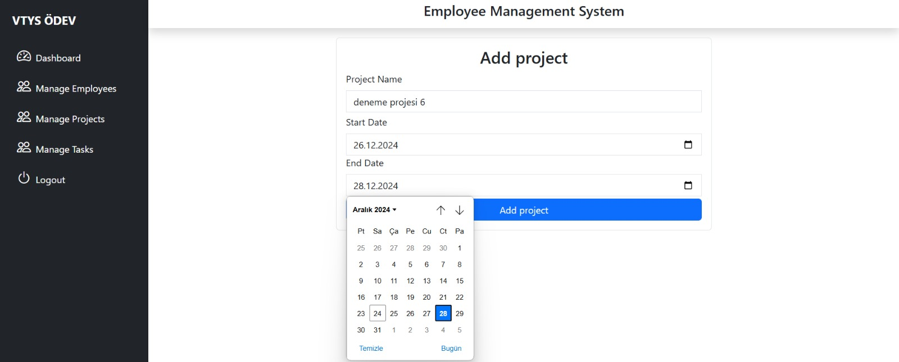
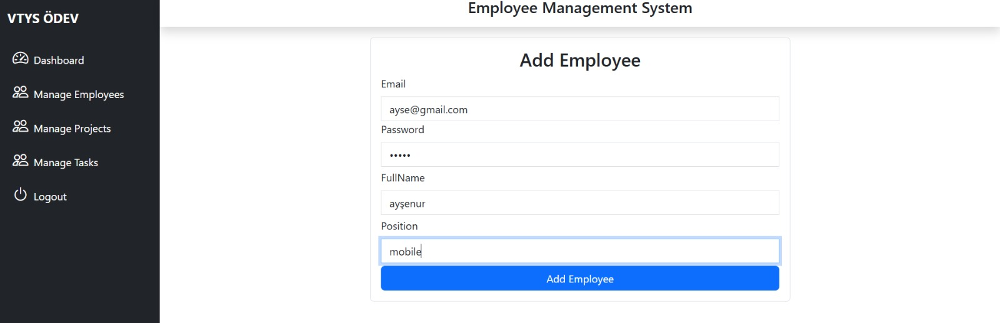
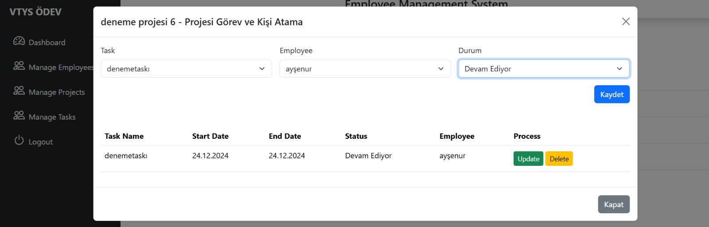
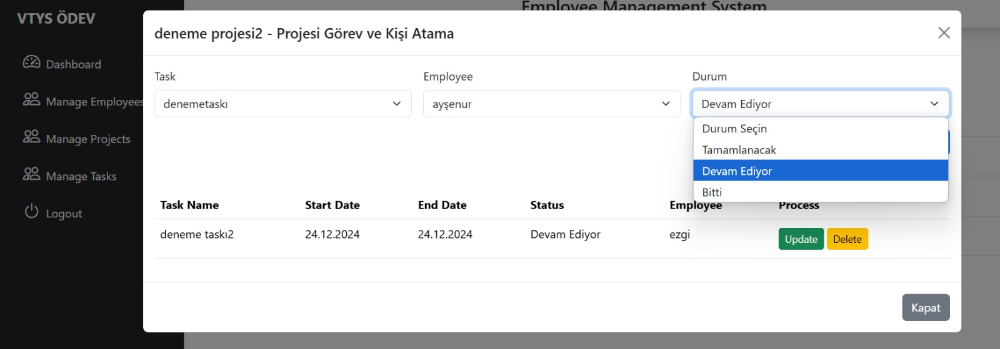
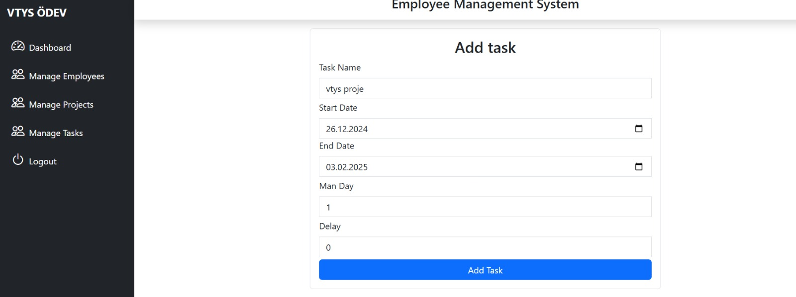

# Proje Yönetim Yazılımı

## Genel Bakış
Bu Proje Yönetim Yazılımı, kullanıcıların projeler oluşturmasını, çalışan ve görev yönetimi yapmasını sağlayan web tabanlı bir uygulamadır. Yazılım, projelerin etkin bir şekilde yönetilmesine ve zamanında teslim edilmesine olanak tanır. Görev durumları takip edilir ve gecikme durumları dinamik olarak güncellenir.

---

## Kullanılan Teknolojiler

- *Front-End*: HTML, CSS, JavaScript, React, Bootstrap, Material UI
- *Back-End*: Node.js, Express.js
- *Veritabanı*: MySQL (PhpMyAdmin ile yönetim)
- *Ekstra Kütüphaneler*: Cors, Jsonwebtoken, Bcrypt.js, Cookie-parser, Multer

---

## Özellikler

### 1. Proje Yönetimi
- Yeni projeler oluşturma ve mevcut projeleri listeleme.
- Proje başlangıç ve bitiş tarihlerini girme.

### 2. Görev Yönetimi
- Görevlere başlangıç ve bitiş tarihi, adam/gün değeri ekleme.
- Görevlerin çalışanlara atanması.
- Görev durumlarını takip etme (Tamamlanacak, Devam Ediyor, Tamamlandı).
- Gecikme durumlarında proje bitiş tarihinin otomatik güncellenmesi.

### 3. Çalışan Yönetimi
- Çalışan ekleme, çıkarma ve güncelleme.
- Çalışan detay sayfasında geçmiş ve güncel görevlerini görüntüleme.
- Çalışanın zamanında tamamladığı ve geciktirdiği görevlerin istatistiklerini görselleştirme.

### 4. Kullanıcı Arayüzü
- Kullanıcı dostu ve modern bir arayüz.
- Projeler ve görevlerin kolayca yönetilebileceği bir kontrol paneli.

---

## Geliştirici Ekip

 <table>
    <tr>
      <th>İsim</th>
      <th>İletişim</th>
    </tr>
    <tr>
      <td>Ezgi Şaşı</td>
      <td>
        <a href="https://github.com/ezgisasi" target="_blank"></a>
        <a href="https://www.linkedin.com/in/ezgi-%C5%9Fa%C5%9F%C4%B1-aa66212b2/" target="_blank"></a>
      </td>
    </tr>
    <tr>
      <td>Revas Akın</td>
      <td>
        <a href="https://github.com/rewas72" target="_blank"></a>
        <a href="https://www.linkedin.com/in/revas-ak%C4%B1n-50187227a/" target="_blank" ></a>
      </td>
    </tr>
    <tr>
      <td>Ayşenur Sunay</td>
      <td>
        <a href="https://github.com/aysenur-sunay" target="_blank"></a>
        <a href="https://www.linkedin.com/in/ay%C5%9Fenur-sunay-1511042b9/" target="_blank"></a>
      </td>
    </tr>
   <tr>
      <td>Merve Nur Türk</td>
      <td>
        <a href="https://github.com/mervenrtrk" target="_blank"></a>
        <a href="https://www.linkedin.com/in/merve-nur-t%C3%BCrk-78745729b/" target="_blank" ></a>
      </td>
    </tr>
  </tr>
  </table>

---

## Uygulama Görselleri
<p align="center">









 


</p>

---


## Kurulum ve Yükleme

1. Depoyu klonlayın:
   ```bash
   git clone https://github.com/rewas72/employee-management.git
   ```

2. Proje dizinine gidin:
   ```bash
   cd employee-management
   ```

3. Bağımlılıkları yükleyin:
   ```bash
   npm install
   ```

4. Veritabanı Bağlantısını Yapılandırın:
- db.js dosyasını açın ve MySQL veritabanı bilgilerinizi ekleyin.

5. Uygulamayı çalıştırın: backend

   ```bash
   npm start
   ```
   5. Uygulamayı çalıştırın: frontend

   ```bash
   npm run dev
   ```
---

## Veritabanı Tasarımı

### Tablolar

#### Employees (Çalışanlar)
| Alan Adı      | Tür         | Açıklama                 |
|---------------|-------------|--------------------------|
| employeeId    | PK, int     | Çalışan ID              |
| email         | nvarchar(100)| E-posta adresi          |
| password      | nvarchar(50) | Şifre (hashlenmiş)      |
| fullName      | nvarchar(100)| Ad Soyad                |
| position      | nvarchar(50) | Pozisyon                |

#### Projects (Projeler)
| Alan Adı      | Tür         | Açıklama                 |
|---------------|-------------|--------------------------|
| projectId     | PK, int     | Proje ID                |
| projectName   | nvarchar(100)| Proje Adı               |
| startDate     | datetime    | Başlangıç Tarihi         |
| endDate       | datetime    | Bitiş Tarihi            |
| taskData      |nvarchar(100)| Görev Verisi            |

#### Tasks (Görevler)
| Alan Adı      | Tür         | Açıklama                 |
|---------------|-------------|--------------------------|
| taskId        | PK, int     | Görev ID                |
| projectId     | FK, int     | Proje ID                |
| taskName      | nvarchar(100)| Görev Adı               |
| startDate     | datetime    | Başlangıç Tarihi         |
| endDate       | datetime    | Bitiş Tarihi            |
| manDay        | int         | Adam/gün Değeri         |
| status        | nvarchar(20)| Durum (Tamamlanacak/Devam Ediyor/Tamamlandı) |
| delay         | int         |  Gecikmeler              |

---


## Lisans
Bu proje, GNU General Public License (GPL) ile lisanslanmıştır. Daha fazla bilgi için [LICENSE](./LICENSE) dosyasını inceleyin.

---
